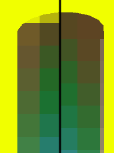
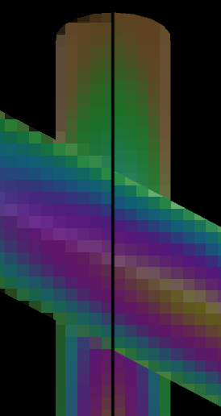
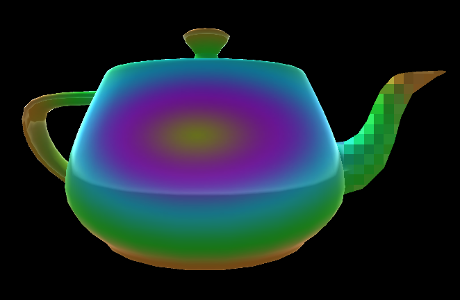
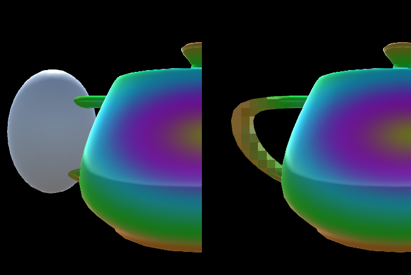
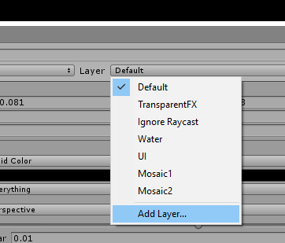
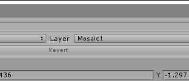

This is a Unity script to give clean mosaics.

No bleeding with the scene
--------------------------

This mosaic doesn't bleed mosaiced objects with the scene around them.
On the left, the cylinder has bled with the yellow background, making the outline
muddy.  On the right, the cylinder is only mosaiced with itself.  It's blurred,
but the outline is still easy to see.

No bleeding between mosaics
---------------------------

Multiple objects can be mosaiced separately, without bleeding between them.
This blurs each object while keeping them distinguishable.

On the left, an old mosaic has blurred both objects together.  On the right, both
objects are mosaiced, but the outline is still visible.

Texture masks
-------------

A texture can be used to define which parts of an object should be mosaiced.
This allows precise control over what gets blurred.

Below, the spout of the teapot has been painted white in the mask texture, so
only that part of the model is blurred.

Spherical mosaic masks
----------------------

Alternatively, a cylinder can be used to mask which part of the object you want to mosaic.
For example, this can be used to mosaic only a game character's eyes.

The left side shows the mask cylinder.  The right shows the result: just the handle
of the teapot is blurred.  The cylinder can be scaled to fit the desired shape,
and parented to the object or a character's skeleton so it follows the object.

Usage
-----

See "Test scene\Mosaix example.unity" for an example.

- In the Inspector, Layer -> Add Layer.  Create a layer for objects to mosaic.  Call
it something like "Mosaic".

- Select the object to mosaic, and put it in the new layer.  More than one object can
be in the layer.

- Attach Mosaix\Scripts\Mosaix.cs to your camera.
- Set "Layer Name" to the layer you created above, eg. "Mosaic".
- Connect shaders:
  * Mosaix\Shaders\Mosaic.shader -> "Mosaic Shader"
  * Mosaix\Shaders\ExpandEdges.shader -> "Expand Edges Shader"
  * Mosaix\Shaders\Premultiply.shader -> "Premultiply Shader"

Play the scene, and the object will be mosaiced.

Settings
--------

**Mosaic Blocks** The number of mosaic blocks.  Higher numbers give smaller mosaic blocks.  
**Shadows Cast On Mosaic** Whether other objects cast shadows on the mosaic.  Turning this
off may be faster, but may look wrong depending on your scene's lighting.  
**High Resolution Render** A high-quality mode is used to render the mosaic.
This results in less flicker as objects move, more accurate lighting, and is required
for masking and alpha.  
**Alpha** Fade out the mosaic.  This can be animated to transition the mosaic on and off
smoothly.

Texture masking
---------------

To mask with a texture, select "Texture" as the masking mode, and connect a texture
to Masking Texture.  White areas in the mask will be blurred and black ones won't.

This only works well if the masking layer only contains a single object, since this
only uses a single texture, but allows fine control over blurring.

Sphere masking
--------------

To mask the mosaic, select "Sphere" as the masking mode, create a 3D sphere and connect
it to Masking Sphere.  Place the sphere, and parent it correctly so it follows the object
to be mosaiced.  Once the sphere is placed, disable its Mesh Renderer so the sphere isn't
visible.

The object must be a sphere, but it can be scaled and rotated into oblong shapes to cover
non-spherical areas.

Mask Fade can be set to fade away the mosaic.  At 0, the mosaic cuts off sharply at the
edge of the sphere.

Multiple mosaics
----------------

To mosaic two objects separately, add a second Mosaix script to your camera, and use it
with a separate layer.  The objects won't bleed together, and can use different settings,
such as a different number of mosaic blocks.

