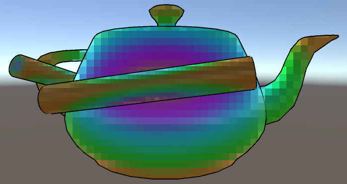

This Unity shader allows cleanly pixelating (mosaicing) objects in your scene.

See this **[live WebGL demo](https://s3.amazonaws.com/unity-mosaix/unity-chan-demo/index.html)**, or
this [demo video](https://s3.amazonaws.com/unity-mosaix/mosaix-demo.mp4).

This code is in the public domain.

No bleeding with the scene
--------------------------

This mosaic doesn't bleed mosaiced objects with the scene around them.
On the left, the cylinder has bled with the yellow background, making the outline
muddy.  On the right, the cylinder is only mosaiced with itself.  It's blurred,
but the outline is still easy to see.

No bleeding between mosaics
---------------------------

Multiple objects can be mosaiced separately, without bleeding between them.
This blurs each object while keeping them distinguishable.

On the left, an old mosaic has blurred both objects together.  On the right, both
objects are mosaiced, but the outline is still visible.

Usage
-----

See "Test scene\Demo scene.unity" for an example.

- In the Inspector, Layer -> Add Layer, and create a layer to mosaic.  

- Put objects to mosaic in the new layer.  

- Select your camera and add Component → Effects → Mosaix.
- Set "Mosaic Layer" to the layer you created.
- Play the scene.

Sphere masks
------------

A sphere can be used to mask which part of the object you want to mosaic.
For example, this can be used to mosaic only a character's eyes.

The left side shows the mask cylinder.  The right shows the result: just the handle
of the teapot is blurred.  The cylinder can be scaled to fit the desired shape,
and parented to the object or a character's skeleton so it follows the object.

To use sphere masks, enable **Sphere masking**, and connect a 3D sphere to **Masking Sphere**.
Place the sphere, and parent it correctly so it follows the object to be mosaiced.  Once the
sphere is placed, disable its Mesh Renderer so the sphere isn't visible.

The object must be a sphere, but it can be scaled and rotated into oblong shapes to cover
non-spherical areas.  The **Sphere Collider** component should be deleted from the sphere,
so objects don't collide with it.

**Mask Fade** can be set to fade the mosaic away smoothly outside the sphere.  At 0, the
mosaic cuts off sharply at the edge of the sphere.

Texture masks
-------------

A texture can be used to define which parts of an object should be mosaiced.
This allows precise control over what gets blurred.

Below, the spout of the teapot has been painted white in the mask texture, so
only that part of the model is blurred.

To mask with a texture, enable **Texture masking**, and select a **Masking Texture**.
White areas in the mask will be blurred and black ones won't.  The masking texture will
use the same UVs as the models being rendered.

This only works well if the masking layer only contains a single object, since this
only uses a single texture, but allows fine control over blurring.

Anchoring
---------

The mosaic can be anchored to an object.  When the object moves, the mosaic will shift
with it, making the motion of the object clearer.  Optionally, the mosaic can also scale
with the object, so the mosaic gets finer as the object gets further away.

[Anchoring demo](https://s3.amazonaws.com/unity-mosaix/anchoring-demo.mp4)

To use anchoring, connect a transform to **Anchor**, then enable **Follow Anchor** or
**Scale mosaic size**.

If **Follow Anchor** is enabled, the mosaic lines follow the anchor as it moves around
on screen.

If **Scale mosaic size** is enabled, the mosaic will also scale itself as the anchor gets
further and closer to the camera.  This allows the mosaic to be smaller when the object is
far from the camera and finer as the object is closer to the camera.

Integrating with cartoon outline shaders
----------------------------------------

Existing cartoon outline shaders can be drawn as a separate pass.  This allows mosaicing an
object, but retaining clean outlines.  See **DemoUnityChan.unity** for an example.

By creating a shader that calls the mosaic with UsePass, you can integrate other effects
on top of the mosaic, such as cartoon outlines.  Assign your alternate shader to a material,
and set that material as the Mosaic Material.

Multiple mosaics
----------------

To mosaic two objects separately, add a second Mosaix script to your camera, and use it
with a separate layer.  The objects won't bleed together, and can use different settings,
such as a different number of mosaic blocks.

All settings
------------

**Mosaic Layer** The display layer to mosaic.  
**Mosaic Blocks** The number of mosaic blocks.  Higher numbers give smaller mosaic blocks.

**Masking/Texture masking** If enabled, the mosaic will be masked using a texture.  
**Masking/Masking Texture** If **Texture masking** is enabled, this is the texture to use as a mask.  
**Masking/Sphere masking** If enabled, the mosaic will only display within a bounding sphere.  
**Masking/Masking Sphere** If **Sphere masking** is enabled, this is the sphere to use as a mask.  
**Masking/Mask Fade** If **Sphere masking** is enabled, this is how smoothly to fade out the mosaic outside the sphere.  

**Anchoring/Anchor** A transform to use as a mosaic anchor, if desired.  
**Anchoring/Follow Anchor** If enabled, the mosaic will follow the anchor around on screen instead of being fixed in place.  
**Anchoring/Scale mosaic size** If enabled, the mosaic will get bigger as the anchor gets closer to the camera.  

**Advanced Settings/Shadows Cast On Mosaic** Whether other objects cast shadows on the mosaic.  Turning this
off may be faster, but may look wrong depending on your scene's lighting.  
**Advanced Settings/High Resolution Render** A high-quality mode is used to render the mosaic.
This results in less flicker as objects move, more accurate lighting, and is required
for masking and alpha.  
**Advanced Settings/Alpha** Fade out the mosaic.  This can be animated to transition the mosaic on and off smoothly.  
**Advanced Settings/Render Scale** How far to render offscreen for creating the mosaic.  A value of 1.1 is
recommended.

**Shaders/Mosaic Material** The material to use when rendering the mosaic.  This is usually **Mosaix/Shaders/Mosaic.mat**,
but can be set to another material to layer other effects on top of the mosaic.  
**Shaders/Resize Shader** This should be set to **Mosaix/Shaders/Resize.shader**.  
**Shaders/Expand Edges Shader** This should be set to **Mosaix/Shaders/ExpandEdges.shader**.  

Limitations
-----------

Transparent objects aren't supported.

